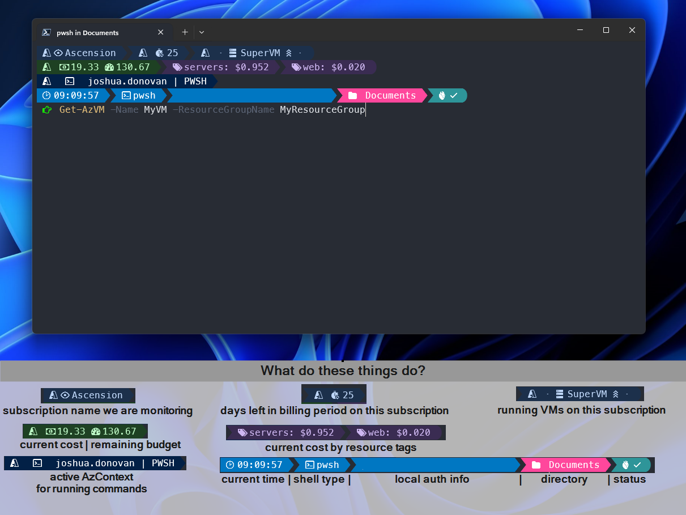

# Oh_My_POSH 
> Everything below is just for fun, this is not intended to be a tutorial on Az Modules, Oh My Posh...etc
> 
> Nothing here is guaranteed to work outside of my environment.
>
> Use at your own risk. This repository carry's no warranty or support.
> 


## What it does


This PowerShell Profile Script and Oh My Posh Template tracks Azure Spend in real time (5 minute intervals) and even has the ability to display desired resource grouping costs by resource tags!

The PowerShell Profile Script uses runspaces to allow for async processing of your Azure Reports without slowing down your access to the console (much). Because runspaces are a new thread inside the same process and not a new process (like Start-Job) we can pass information back to Oh My Posh through environment variables. 

In the current configuration, this data updates once every 5 minutes. 

I did find that using the Az Module in the runspaces with a service principal was causing my main console to have its AzContext set to the service principal when the report is ran. So, that is why the Az cmdlets are run within jobs on a different process to avoid screwing with the current AzContext I might be actively using.

> NOTE: I have not added automatically pulling a budget total for the remaining cost. This is "hard coded" in the PowerShell Profile to 150.00. 

## Environment
- Windows 10/11
- Administrator Access required for installations
- Windows Terminal (Preview) [There is a fix for icons being small available in preview]
- PowerShell 7.3.6
- Font/Icons: Meslo LGM NF

## Dependancies
- Oh My Posh
- Microsoft.PowerShell.SecretManagement
- Microsoft.PowerShell.SecretStore
- PowerShell Az Module
- PowerShell Az.ResourceGraph Module

# Installations
## Oh My Posh 
[ohmyposh.dev](https://ohmyposh.dev/docs/installation/windows)

Follow your preferred installation method, I personally installed from the Microsoft Store.

### Configuration

- Save the cheap-cloud-azure.omp.json file to your PowerShell directory. `\Documents\WindowsPowerShell\cheap-cloud-azure.omp.json`

[ohmyposh Fonts](https://ohmyposh.dev/docs/installation/fonts)
- Download your preferred Font Pack and Install in Windows Settings > Personalization > Fonts

[ohmyposh docs](https://ohmyposh.dev/docs/configuration/general)
- Good Reading if you want to understand how to customize Oh My Posh


## PowerShell 7
In a PowerShell Prompt: 

`winget install --id Microsoft.Powershell --source winget`

[PowerShell 7 Docs](https://learn.microsoft.com/en-us/powershell/scripting/install/installing-powershell-on-windows?view=powershell-7.3)

## Windows Terminal (Preview)
- Available for install in the Windows Store.
- After it is installed, click the dropdown next to the +, select Settings.
- Change Default Profile to PowerShell 7
- Select your preferred color settings (I use One Half Dark)
- On the "Rendering" Tab, make sure "Use the new text renderer("AtlasEngine")" is On/Enabled.
- Towards the bottom you should see the PowerShell 7 Profile Configuration
    - Change the Font face to the "Nerd Font" you chose to install. (I am using MesloLGL Nerd Font)
- Save

## PowerShell Modules
### Az
```
Install-Module -Name Az -Repository PSGallery
```
### Az.ResourceGraph (Not included in default Az Module install)
```
Install-Module -Name Az.ResourceGraph -Repository PSGallery
```
### Secrets / Environment
```
Install-Module -Name Microsoft.PowerShell.SecretManagement -Repository PSGallery
Install-Module -Name Microsoft.PowerShell.SecretStore -Repository PSGallery
```

## Setup your Azure Access (New Application Registration)
[App Registration Docs](https://learn.microsoft.com/en-us/azure/active-directory/develop/quickstart-register-app)
- Login to portal.azure.com
- Navigate to Azure Active Directory
- On the left find App Registrations
- Click New Registration
    - Give your registration a name that makes sense to you (We will be using it to periodically query Billing and Azure Resource Graph Data.)
    - Select Single Tenant
    - No Redirect URL is needed
    - Register
- On the page for your registration
    - Copy the Application (client) ID
    - Copy the Directory (tenant) ID
    - Go to Certificates & Secrets
    - Generate a new secret (copy the secret Value on this page, it will not be retrievable after you leave)
        - Make sure you grab the secret Value and not the Secret ID (We don't need the ID)
- Exit Azure Active Directory and go back to the main portal.azure.com
    - Navigate to the Subscription you are wanting to grant this app permissions to.
    - Go to Access Control (IAM)
    - Click Add / Add role assignment
    - I'm using "Reader", but feel free to customize what RBAC role you prefer. (after selecting the role, got to the Members tab)
    - select User, Group or Service Principal and click + Select members
    - Your App registration will NOT show by default, search for it by name and it should show for you to select.
    - Assign the permissions.

## Setup your secrets vault
[Secret Manager and Secret Store Updates](https://devblogs.microsoft.com/powershell/secretmanagement-and-secretstore-updates/)

[Secret Manager Github](https://github.com/powershell/secretmanagement)

Provision your vault for this purpose:
```
Register-SecretVault -Name PWSH_PROFILE -ModuleName Microsoft.PowerShell.SecretStore
```
>&nbsp;
> 
>WARNING:
>
>Setting the Authentication to `None` is less secure than Password. Specifying `None` may be useful for testing scenarios but should not be used with important secrets. 
>
>[Cmdlet Docs](https://learn.microsoft.com/en-us/powershell/module/microsoft.powershell.secretstore/set-secretstoreconfiguration?view=ps-modules#parameters)
>
>&nbsp;

I am choosing to set my authentication to none for ease of use, don't follow this blindly and understand what this means before configuring your environment to be the same. Configure at your own risk. `If you choose not to follow this configuration you will have to customize this to use a password to unlock the vault`. 
```
Set-SecretStoreConfiguration -Authentication none
```
Fill in your application registration data we copied earlier plus the SubscriptionID we are monitoring
```
Set-Secret -Name POSH_AZURE_TENANT_ID -Secret "{ Tenant ID }" -Vault PWSH_PROFILE
Set-Secret -Name POSH_AZURE_SUBSCRIPTION_ID -Secret "{ Subscription ID }" -Vault PWSH_PROFILE
Set-Secret -Name POSH_AZURE_CLIENT_ID -Secret "{ Client ID }"
Set-Secret -Name POSH_AZURE_CLIENT_SECRET -Secret $(ConvertTo-SecureString "{ Client Secret }" -AsPlainText) -Vault PWSH_PROFILE
```

## PowerShell Profile
The PowerShell Profile is where most of the magic happens for my Posh Segments, because of the lag associated with running the commands to update each time a new prompt shows, I am instead having a runspace that runs a few commands every 5 minutes and then updates the associated environment variables for Oh My Posh to reference. 

This works well to not slow down the loading of the Shell, but also display the information I am after. 

Launch your profile configuration by typing one of the following in your PowerShell console.
```
# Using VSCode
if (!(Test-Path $profile))
{
    New-Item -Path $profile -ItemType File -Force
}
code $profile
```

```
# Not using VSCode
if (!(Test-Path $profile))
{
    New-Item -Path $profile -ItemType File -Force
}
notepad $profile
```
>I am assuming there is no profile set-up yet, please take care if you are modifying an existing profile to not hurt your exsiting profile config.

Copy the Microsoft.PowerShell_profile.ps1 to the profile file you just opened.


